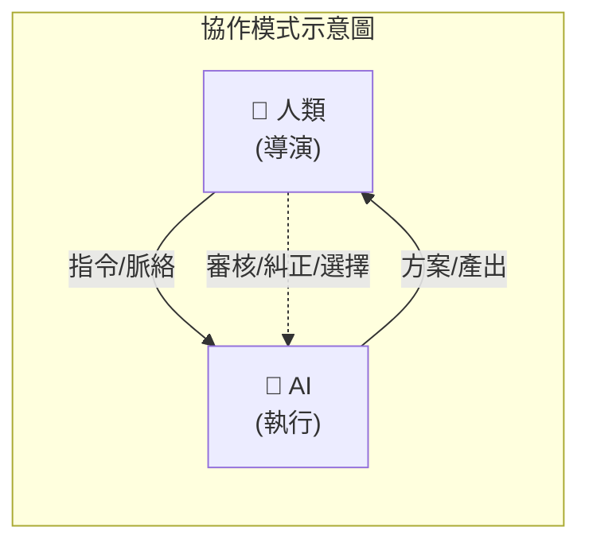

# AI Agent 協作模式比較

## 我們的協作模式

本專案採用 **Human-in-the-Loop (HITL)** 模式，更精確地說是 **Supervised Pair Programming**：

**特點：**
- 人類掌握最終決定權
- AI 提供多個方案供選擇
- 每個重要動作需人類確認
- 即時糾正與迭代

## AI Agent 協作模式光譜

<table>
<tr>
<th></th>
<th>已知用火</th>
<th>Copilot</th>
<th>HITL ⭐</th>
<th>Delegator</th>
<th>Supervisor</th>
<th>Autonomous</th>
</tr>
<tr>
<td></td>
<td colspan="6" style="text-align:center;color:#e5c07b;font-size:13px;">
← 人類控制 ─────────────────────────────────────── AI 自主 →
</td>
</tr>
<tr>
<td><strong>名稱</strong></td>
<td>手寫 Code</td>
<td>副駕駛</td>
<td>人類主導</td>
<td>任務委派</td>
<td>監督者</td>
<td>全自主</td>
</tr>
<tr>
<td><strong>運作</strong></td>
<td>人類全包</td>
<td>人類寫 AI 建議 人類採納</td>
<td>人類決策 AI 執行 人類審核</td>
<td>人類定義範圍 AI 自行完成</td>
<td>人類設定邊界 AI 執行+回報</td>
<td>人類定義目標 AI 完全自主</td>
</tr>
<tr>
<td><strong>範例</strong></td>
<td>Vim/Emacs 純手工</td>
<td>GitHub Copilot 自動補全</td>
<td>Claude Code Cursor Aider</td>
<td>「幫我寫個 備份腳本」</td>
<td>CI/CD 自動部署</td>
<td>AutoGPT Devin</td>
</tr>
<tr>
<td><strong>介入</strong></td>
<td>100%</td>
<td>每行</td>
<td>每個決策</td>
<td>每個任務</td>
<td>異常時</td>
<td>幾乎不</td>
</tr>
<tr>
<td><strong>風險</strong></td>
<td>看人</td>
<td>極低</td>
<td>低</td>
<td>中</td>
<td>中高</td>
<td>高</td>
</tr>
</table>

## 各模式詳細說明

### 0. 已知用火 (手寫 Code)

- **控制權**：人類 100% / AI 0%
- **運作方式**：人類獨立完成所有工作，不依賴 AI 輔助
- **典型應用**：Vim、Emacs、純文字編輯器、傳統 IDE
- **優點**：完全掌控、無 AI 依賴、適合機敏環境
- **缺點**：效率受限於個人能力、容易疲勞出錯、知識盲點難以突破

### 1. Copilot (副駕駛)

- **控制權**：人類 95% / AI 5%
- **運作方式**：AI 只做建議，人類完全掌控
- **典型應用**：GitHub Copilot 自動補全、IDE 智慧提示
- **優點**：風險最低、學習曲線平緩
- **缺點**：效率提升有限

### 2. Human-in-the-Loop (人類主導) ⭐ 本專案採用

- **控制權**：人類 70% / AI 30%
- **運作方式**：人類決策 → AI 執行 → 人類審核 → 迭代
- **典型應用**：Claude Code、Cursor、Aider
- **優點**：品質可控、可即時糾正、適合複雜任務
- **缺點**：需要持續關注、人類是瓶頸

### 3. Delegator (任務委派)

- **控制權**：人類 40% / AI 60%
- **運作方式**：人類定義任務範圍，AI 自行完成後回報
- **典型應用**：「幫我重構這個 module」然後去喝咖啡
- **優點**：解放人類時間
- **缺點**：結果可能偏離預期、需要明確定義邊界

### 4. Supervisor (監督者)

- **控制權**：人類 20% / AI 80%
- **運作方式**：AI 持續執行，只在異常時通知人類
- **典型應用**：CI/CD 自動部署、監控告警系統
- **優點**：高效率、適合重複性任務
- **缺點**：需要完善的邊界條件與異常處理機制

### 5. Autonomous (全自主)

- **控制權**：人類 5% / AI 95%
- **運作方式**：給目標，AI 自己規劃 + 執行 + 驗證
- **典型應用**：AutoGPT、Devin（理想狀態）
- **優點**：完全解放人類
- **缺點**：可靠性存疑、容易失控、成本高、目前技術尚未成熟

## Human-in-the-Loop 的實踐要素

基於本次協作經驗，HITL 模式的關鍵實踐：

| 要素 | 實踐方式 | 案例 |
|------|----------|------|
| 提供脈絡 | 告知專案慣例與歷史決策 | 「我們之前怎麼做的？」 |
| 審核決策 | 要求 AI 先說明計畫 | 「先說計畫再動手」 |
| 質疑合理性 | 確認工具能力與限制 | 「s5cmd 有支援 tagging 嗎？」 |
| 環境適配 | 判斷建議是否適合當前環境 | 「AWS EC2 不建議開 swap」 |
| 部署後驗證 | 實際確認執行結果 | 發現子進程繼承 oom_score_adj |
| 安全把關 | 檢查敏感資訊 | 「那個 token 不能 commit！」 |

## 結論

目前 AI Agent 技術的成熟度，**Human-in-the-Loop** 仍是生產環境最可靠的選擇。完全自主的 Agent 是未來願景，但現階段：

- ✅ HITL 提供最佳的**品質/效率平衡**
- ✅ 人類審核可以**即時糾正** AI 的錯誤
- ✅ 適合處理**複雜、高風險**的任務
- ⚠️ 需要人類具備**領域知識**來判斷 AI 產出

---

*「AI 是很強的執行者，但需要人類當導演。」*
