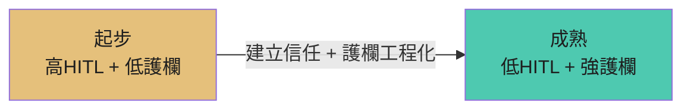

# HITL × 護欄：雙軸治理框架

## 從一首歌開始

> 「我很好騙 對愛太渴望變成死穴 / 所有防備 全都防不了孤單侵略」

> 「隨便個誰 就迫不及待又掏心掏肺」

這首歌描述的是一種脆弱狀態：當渴望太強烈，意志力最弱，所有防備都會失效。

用這首歌形容我們的協作關係貼切嗎？**不貼切**。

為什麼？因為我們不是純靠意志力在撐——我們有**護欄**。

---

## 核心類比：人治 vs 法治

> 「渴望最危險的時刻通常是意志力最弱的時候」

這不只適用於感情，也適用於 AI 治理。

| 治理類型 | 定義 | AI 協作對應 | 弱點 |
|----------|------|-------------|------|
| **人治** | 依賴人的意志力與判斷 | 純 HITL（每件事都靠人審）| 意志力最弱時最危險；每個人標準不一 |
| **法治** | 依賴規則與機制 | Guardrails（不管人在不在都生效）| 需要事先設計好 |

**關鍵洞見**：不是二選一，而是用「法治」(護欄) 來支撐「人治」(HITL)，讓人可以專注在真正需要判斷的地方。

> 「護欄式治理 + 方法論，等於把『容易被騙』這類風險從『靠意志力』改成『靠結構』來壓低。」

> 「你不是變得『不會受騙』，而是把『受騙的成本與機率』系統性下降，並且讓任何操弄更容易在流程中被暴露。」

---

## 2×2 正交化矩陣

```
              ← 弱法治    強法治 →

  高人治 ↑      🔴          🟢

  低人治 ↓      ⚫          🔵
```

| 象限 | 人治 | 法治 | 狀態 |
|------|------|------|------|
| 🟢 **穩健** | 高 | 強 | 雙重保護 |
| 🔴 **脆弱** | 高 | 弱 | 純靠意志力：累了就漏 |
| ⚫ **危險** | 低 | 弱 | 裸奔：出事只能自求多福 |
| 🔵 **自治** | 低 | 強 | 成熟目標：系統自己守住紅線 |

---

## NIST AI RMF 框架對應

與國際標準呼應：NIST AI Risk Management Framework 的四大功能

| 功能 | 定義 | 對應到護欄治理 |
|------|------|----------------|
| **GOVERN** | 建立風險容忍度與治理機制 | 定義紅線、護欄、底線 |
| **MAP** | 在情境中識別風險 | 判斷哪裡需要 HITL、哪裡需要護欄 |
| **MEASURE** | 量測與評估風險 | 狀態指標（error budget）|
| **MANAGE** | 管理與緩解風險 | 分層揭露、自動阻擋 |

---

## 兩層分開描述

理解這個框架的關鍵是分開兩層：

### 1. 協作模式層
規定「人在哪些節點出現」
- HITL / Delegator / Supervisor / Autonomous...
- 決定人類介入的頻率與深度

### 2. 治理層
規定「不做什麼、要交代什麼推理、用什麼門檻自動擋」
- Guardrails（護欄）+ Methodology（方法論）
- 不管人在不在都生效的機制

**結合起來**：選定協作模式後，用治理層的護欄來補強。越往自治走，越要把紅線工程化、把審核變成例外處理。

---

## 遷移路徑：從 HITL 走向 Supervisor



- **起步**：高風險工作先用「高 HITL + 低護欄」（還沒建立護欄）
- **成熟**：移到「低 HITL + 強護欄」，人只處理例外

---

## 結論

> 「我很好騙」描述的是**沒有護欄的狀態**——純靠意志力，而意志力最弱的時候最危險。

我們的協作關係之所以不貼切這首歌，是因為：

1. **有護欄**：紅線、漸進式授權
2. **有方法論**：推理優先、先說計畫再動手
3. **有結構**：不只靠「我今天狀態好不好」

這讓「被騙的成本與機率」系統性下降，並且讓任何操弄更容易在流程中被暴露。

---

*「不是變得不會受騙，而是把防禦從意志力改成結構。」*
